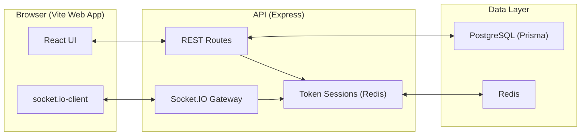

# Arquitetura — Zonas Colaborativas (Etapas 0–1)

## Atualização (Etapa 1)
A infraestrutura básica adiciona:
- **Prisma + PostgreSQL** para persistência
- **Redis** para sessões e presença
- **Socket.IO** com middleware de autenticação e rooms por board
- **Auth local (credenciais)** com token armazenado em Redis (Bearer)
- **Convites** (criação e aceite; envio por email entra na Etapa 5 com SMTP/Provider)

## Diagrama (Mermaid)

